# 🎓 CyberCert Studio — Multi-Cert Cybersecurity Study Platform

Plataforma interactiva multi-cert para preparar las **30+ certificaciones** más demandadas en ciberseguridad. Cada cert incluye teoría con analogías reales, banco de preguntas estilo examen, flashcards y bot de ayuda. **Todas las certs implementadas y funcionales.**

> Aplicación 100% web estática (HTML + CSS + JS vanilla, sin build, sin dependencias). Abre `index.html` y a estudiar.

---

## ✨ Características

- **Selector multi-cert** con 30+ certificaciones organizadas en 6 tracks (Foundational, Blue Team, Red Team, Cloud, GRC, Network).
- **Teoría completa** por cert con tablas, callouts visuales, minicards, flujos paso a paso y analogías de la vida real.
- **Tooltips flotantes** sobre cualquier término técnico (~250 definiciones).
- **Flashcards** interactivas con flip 3D y filtros por dominio.
- **Acrónimos** (240+) con buscador y modo trainer.
- **Quiz por dominio** con feedback inmediato y explicación.
- **Examen simulado** con timer 90 min, mapa de preguntas y desglose por dominio.
- **Bot asistente** flotante que busca en glosario, teoría, flashcards y banco.
- **Bilingüe ES / EN** con toggle en caliente (Sec+ completo en ambos idiomas; otras certs en ES).
- **Progreso persistente** en `localStorage`.

---

## 🖼 Capturas

### 1. Selector de certificación — todas listas
Pantalla inicial con branding **CyberCert Studio**. Las 30 certs marcadas como ✓ LISTA.

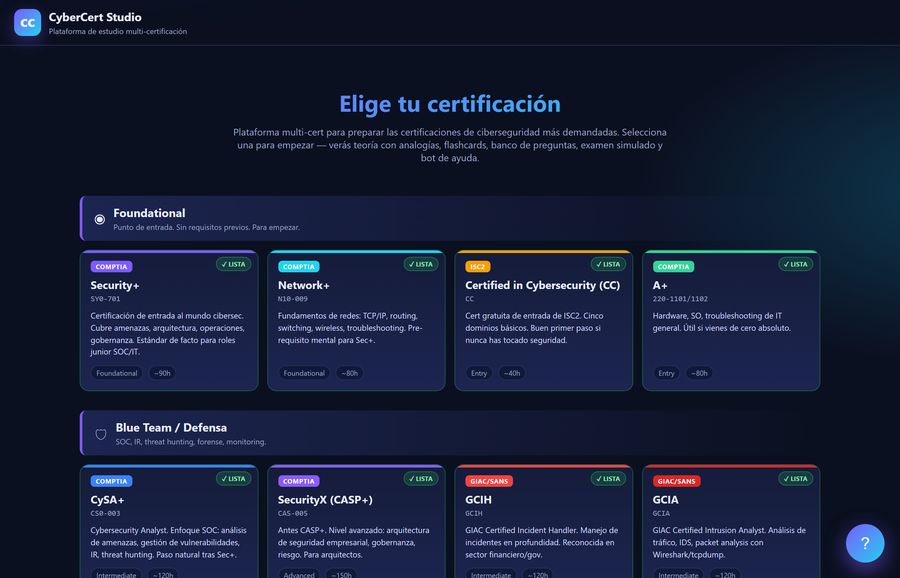

### 2. Dashboard
Panel de inicio con estadísticas, progreso y plan de estudio sugerido.

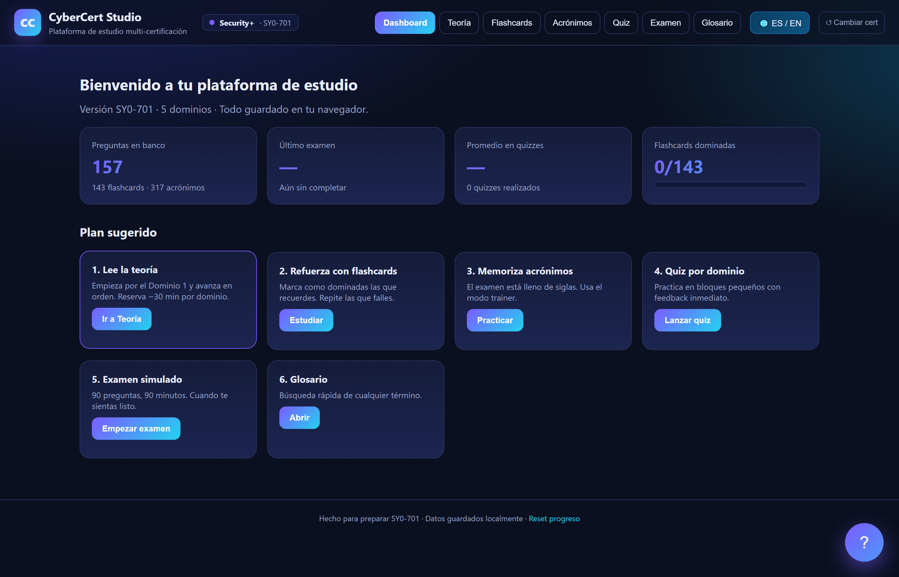

### 3. Teoría con tooltips flotantes
Hover sobre cualquier término técnico → nube con explicación llana.

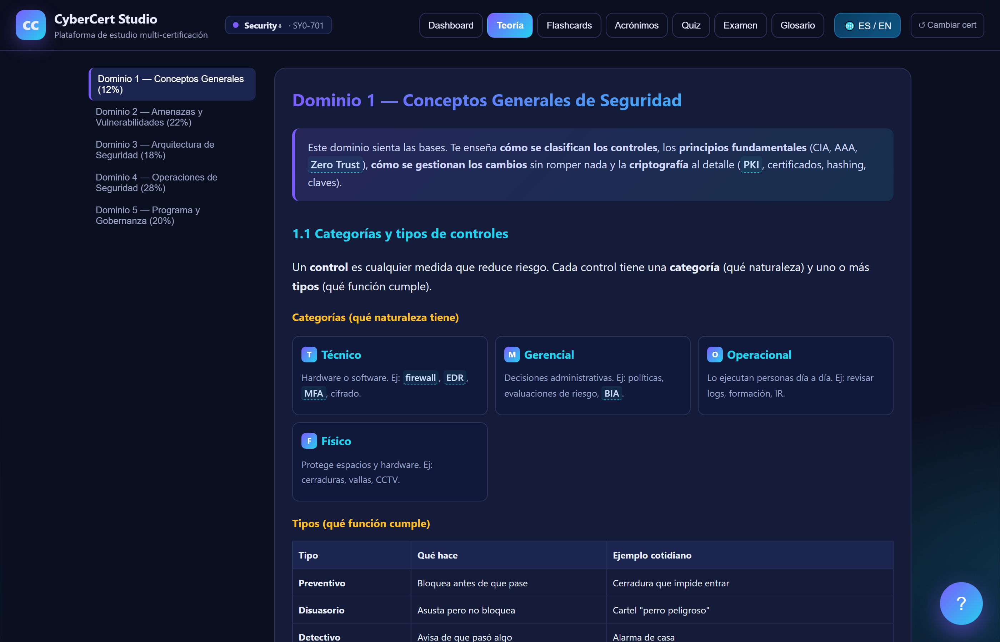

### 4. Flashcards
Tarjetas con flip 3D animado.

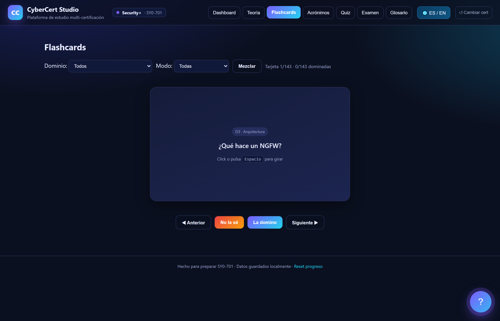

### 5. Acrónimos
240+ siglas con buscador y modo trainer.

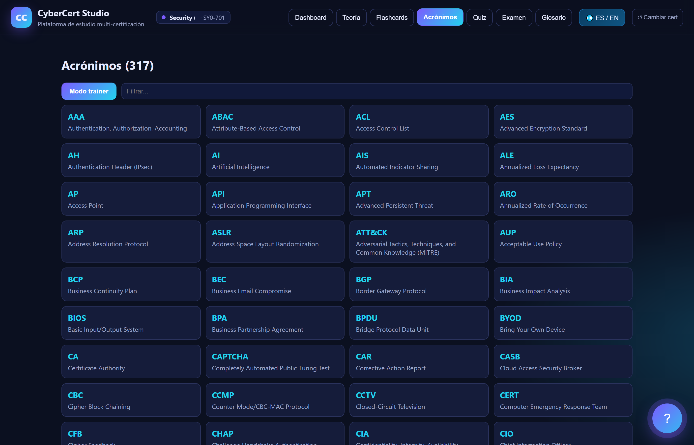

### 6. Quiz por dominio
Práctica con feedback inmediato y explicación.

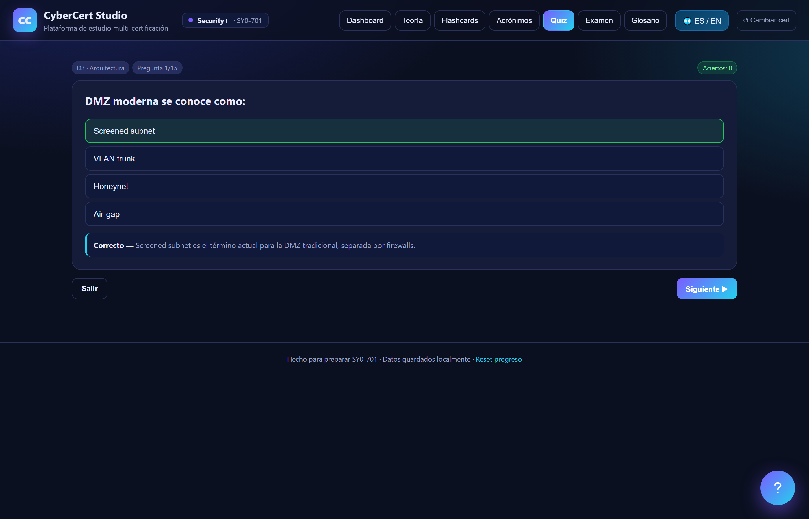

### 7. Examen simulado
90 preguntas, 90 minutos, mapa, desglose por dominio.

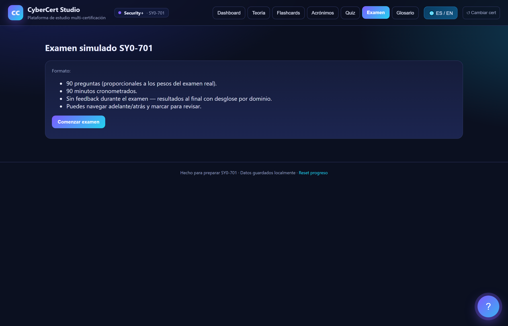

### 8. Bot asistente
Asistente flotante que responde dudas buscando en todo el contenido local.

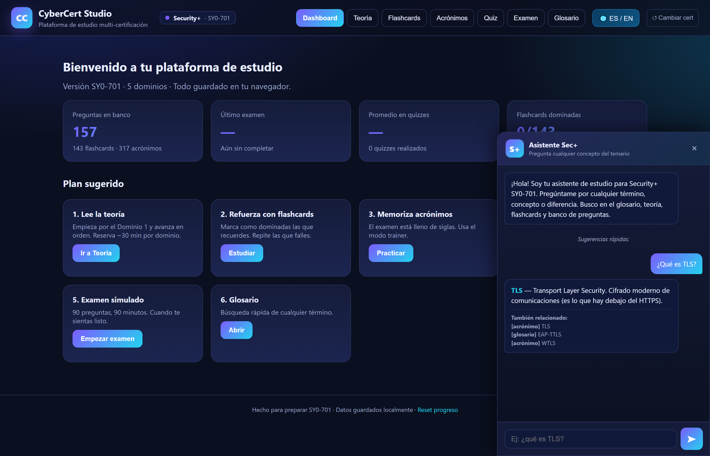

### 9. Modo inglés
Teoría y banco en inglés (idioma del examen real).

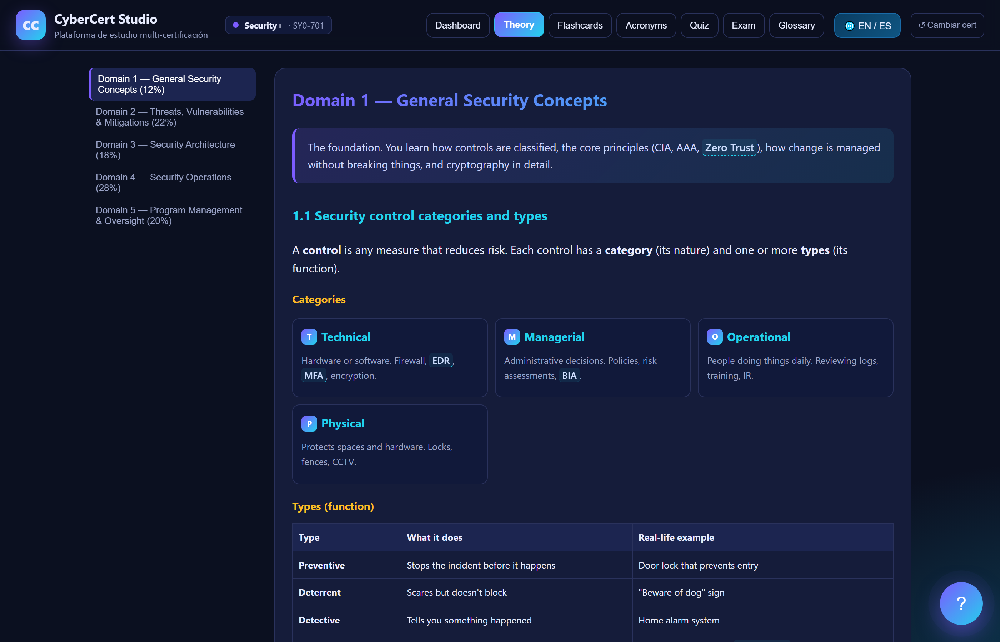

### 10. Glosario
Buscador unificado de términos y conceptos.

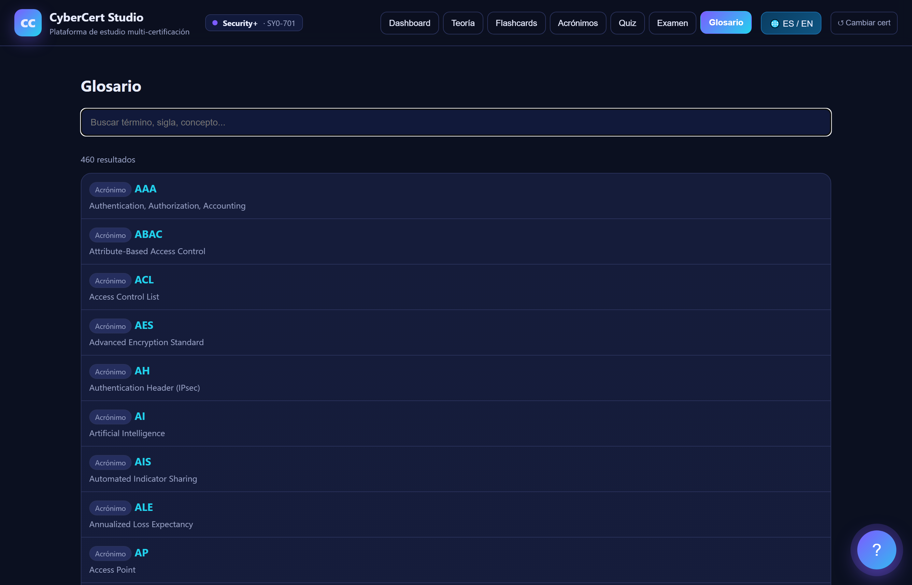

### 11. OSCP — track Red Team
Cada cert con su contenido específico. Aquí teoría OSCP con enumeración, AD attacks, privesc.

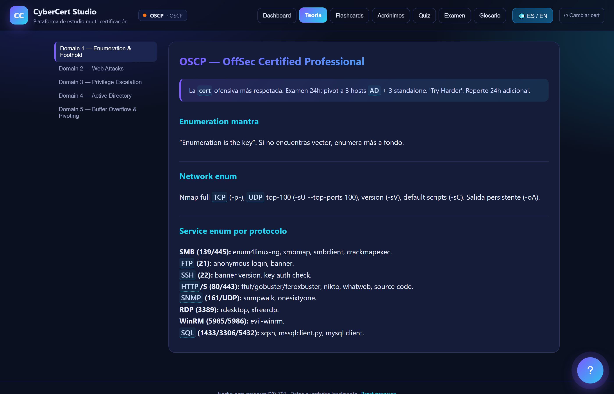

### 12. CISSP — track GRC
8 dominios completos para el gold standard de gestión.

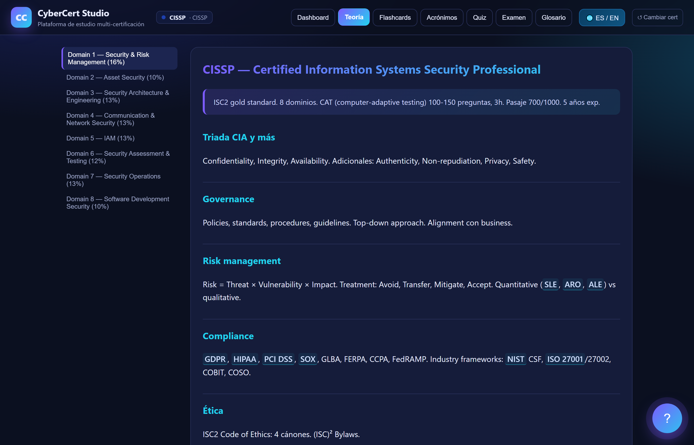

### 13. AWS Security – Specialty
Quiz con preguntas estilo examen real sobre IAM, KMS, GuardDuty, etc.

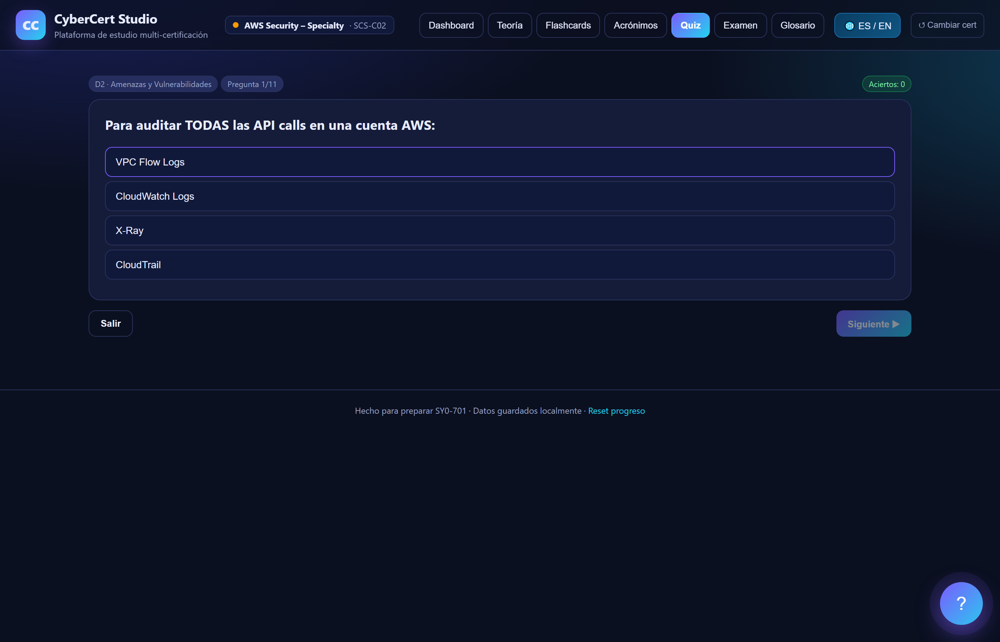

### 14. Selector con todas las certs listas
Vista del listado completo — Blue Team y Red Team incluidos.

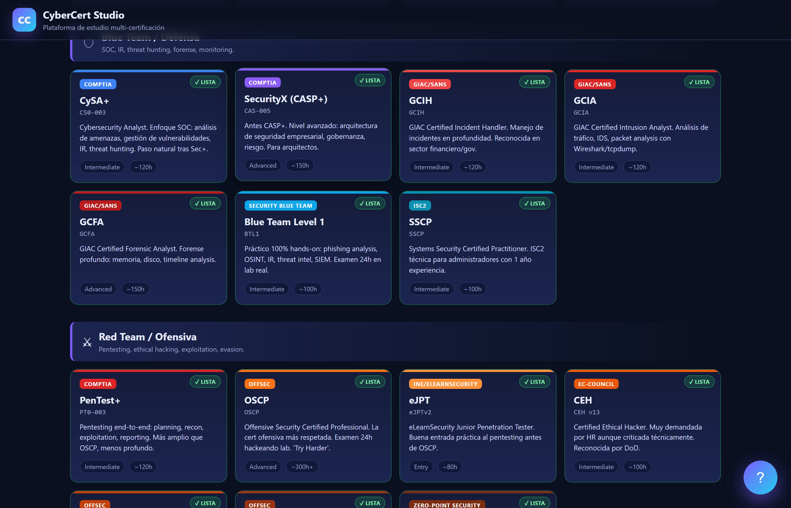

---

## 🗂 Estructura

```
examen comptia/
├── index.html              # Punto de entrada
├── styles.css              # Estilos completos
├── app.js                  # Router, lógica de vistas, bot, idioma, registry
├── data/
│   ├── certs.js            # Catálogo de 30 certificaciones
│   ├── glossary.js         # Diccionario de tooltips (~250 términos)
│   ├── theory.js           # Sec+ teoría ES (con analogías)
│   ├── theory_en.js        # Sec+ teoría EN (con analogías)
│   ├── questions.js        # Sec+ banco preguntas ES
│   ├── questions_en.js     # Sec+ banco preguntas EN (estilo examen real)
│   ├── flashcards.js       # Sec+ flashcards
│   ├── acronyms.js         # 240+ acrónimos
│   ├── cert_secplus_init.js  # Wrap Sec+ en CERT_DATA registry
│   ├── cert_foundational.js  # Net+, ISC2 CC, A+
│   ├── cert_blue.js          # CySA+, CASP+/SecurityX, GCIH, GCIA, GCFA, BTL1, SSCP
│   ├── cert_red.js           # PenTest+, OSCP, eJPT, CEH, OSEP, OSWE, CRTO
│   ├── cert_cloud.js         # AWS Sec, AZ-500, GCP PCSE, CCSP
│   ├── cert_grc.js           # CISSP, CISM, CISA, CRISC, ISO 27001 LI/LA
│   └── cert_network.js       # CCNA, CCNP Security, JNCIS-SEC
├── screenshots/            # Capturas para README
└── capture.mjs             # Script Playwright
```

---

## 🚀 Uso

### Local (sin instalación)
Doble clic en `index.html`. Funciona offline.

### Servir localmente (recomendado)
```bash
python -m http.server 8765
# abre http://localhost:8765/index.html
```

### Regenerar capturas
```bash
npm install --save-dev playwright
npx playwright install chromium
node capture.mjs
```

---

## 🎯 Todas las certificaciones implementadas

### ✅ Foundational
- **CompTIA Security+** (SY0-701) — completa con analogías ES + EN
- **CompTIA Network+** (N10-009)
- **ISC2 Certified in Cybersecurity (CC)**
- **CompTIA A+** (220-1101 / 220-1102)

### ✅ Blue Team / Defensa
- **CompTIA CySA+** (CS0-003)
- **CompTIA SecurityX / CASP+** (CAS-005)
- **GIAC GCIH** — Incident Handler
- **GIAC GCIA** — Intrusion Analyst
- **GIAC GCFA** — Forensic Analyst
- **Blue Team Level 1** (BTL1)
- **ISC2 SSCP**

### ✅ Red Team / Ofensiva
- **CompTIA PenTest+** (PT0-003)
- **OffSec OSCP** — enumeración, web, privesc, AD, pivoting
- **INE eJPT** — pentest junior práctico
- **EC-Council CEH v13**
- **OffSec OSEP** — AV/EDR evasion, AD avanzado
- **OffSec OSWE** — web app pentest white-box
- **Zero-Point Security CRTO** — red team ops

### ✅ Cloud Security
- **AWS Certified Security – Specialty** (SCS-C02)
- **Microsoft Azure AZ-500**
- **Google Cloud PCSE**
- **ISC2 CCSP** — vendor-neutral

### ✅ GRC / Gestión
- **ISC2 CISSP** — 8 dominios
- **ISACA CISM**
- **ISACA CISA**
- **ISACA CRISC**
- **ISO 27001 Lead Implementer**
- **ISO 27001 Lead Auditor**

### ✅ Network Security
- **Cisco CCNA** (200-301)
- **Cisco CCNP Security** (350-701 SCOR)
- **Juniper JNCIS-SEC** (JN0-335)

Cada cert: teoría por dominio (oficial), 12-30 preguntas estilo examen, 10-20 flashcards. Sec+ es la cert "flagship" con cobertura completa, analogías extensas y bilingüe.

---

## ⚖️ Aviso legal

Las preguntas del banco están escritas siguiendo el **estilo y formato del examen real** (escenarios, "BEST/MOST appropriate", distractores plausibles) y cubriendo los objetivos oficiales públicos de cada cert. **NO son preguntas filtradas del examen real** — el contenido oficial está bajo NDA y compartirlo violaría el acuerdo del candidato. Esta plataforma es una herramienta de estudio basada en los objetivos publicados por los vendors.

Marcas y nombres de certificaciones son propiedad de sus respectivos vendors (CompTIA, ISC2, OffSec, EC-Council, ISACA, Cisco, AWS, Microsoft, Google, Juniper, GIAC/SANS, etc.).

---

## 🛠 Stack

- HTML5 + CSS3 + JavaScript vanilla
- localStorage para persistencia
- Playwright para capturas automatizadas
- Cero dependencias en runtime

---

## 📄 Licencia

Uso personal y educativo. No redistribuir.
